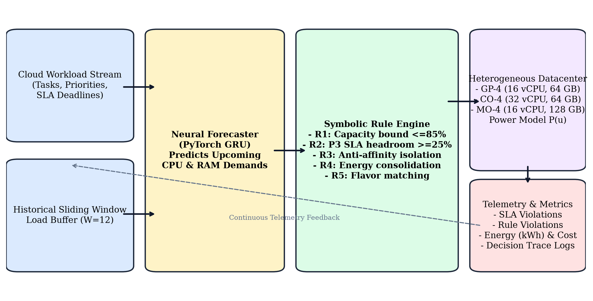
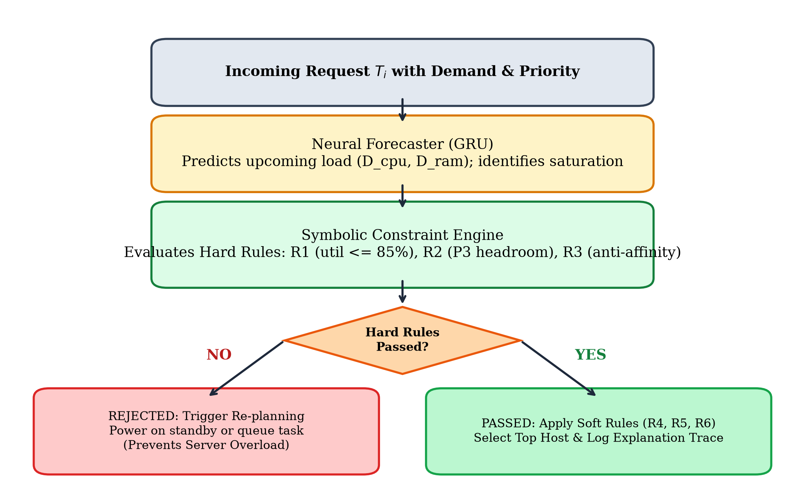
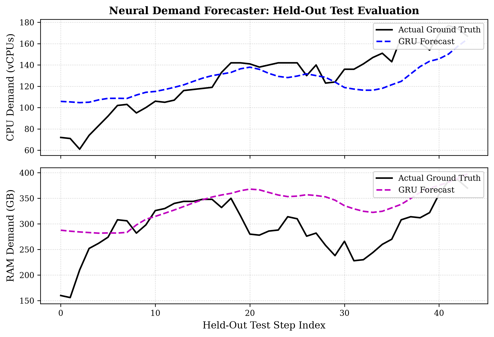
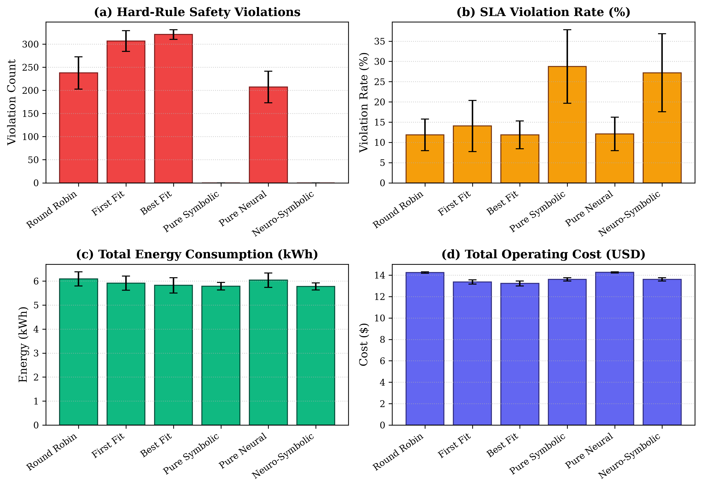
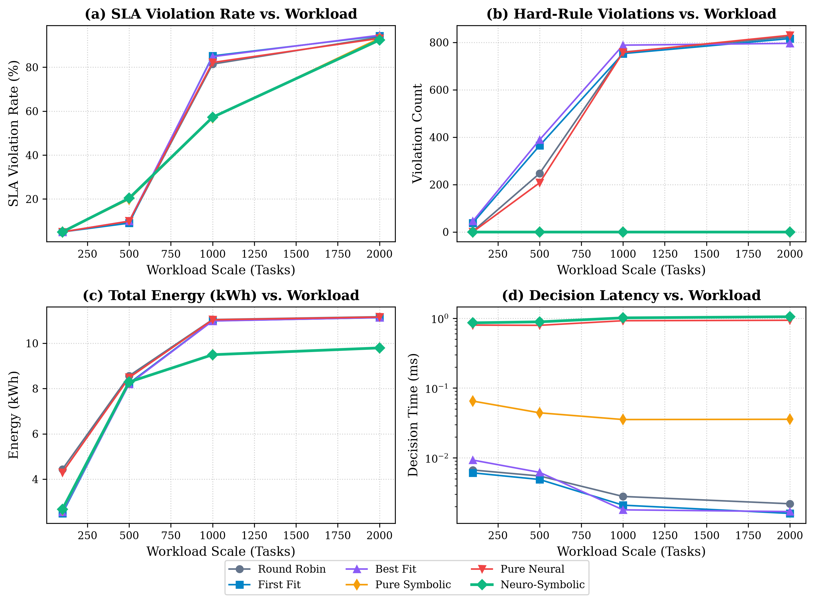
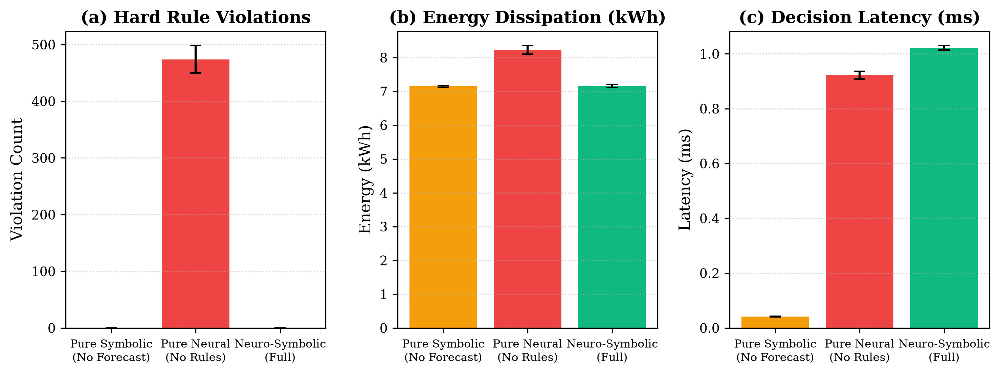
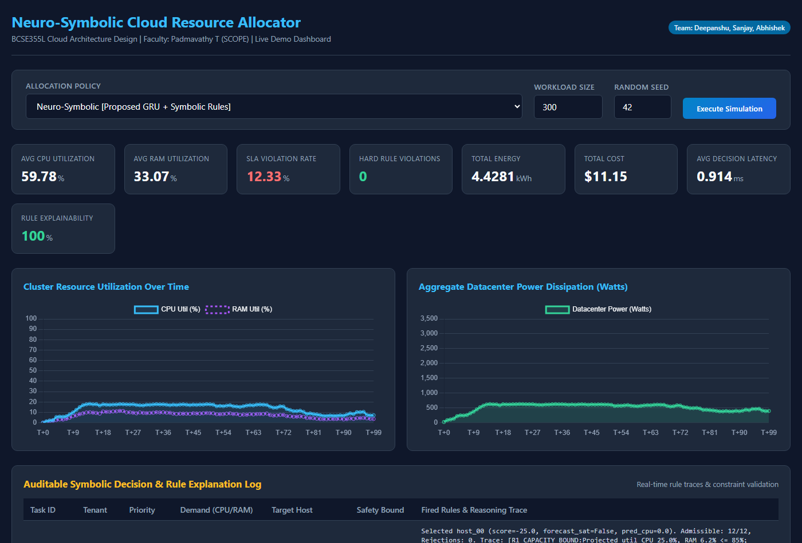
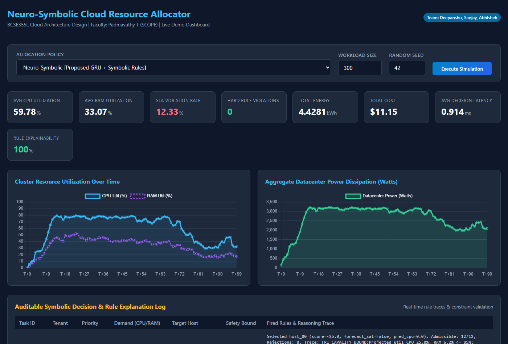
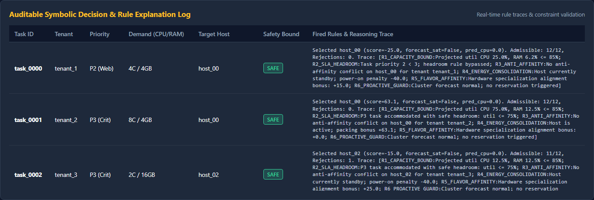
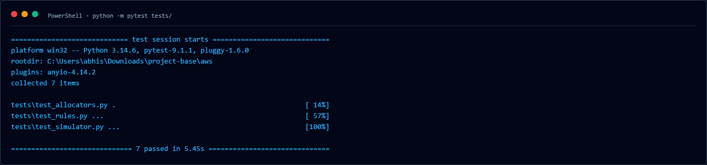

<div align="center">

# ⚡ Neuro-Symbolic Cloud Resource Allocator
### Autonomous, Energy-Optimal & Provably Safe Datacenter Orchestration

[](https://www.python.org/)
[](https://pytorch.org/)
[](https://flask.palletsprojects.com/)
[](#-automated-testing)
[](#-academic-reports--deliverables)
[](LICENSE)

<br/>

**A cohesive hybrid architecture coupling Deep Gated Recurrent Unit (GRU) demand forecasting with first-order deterministic symbolic constraint reasoning for mission-critical multi-tenant clouds.**

*Course: **BCSE355L – Cloud Architecture Design** | Faculty Guide: **Prof. Padmavathy T** | **SCOPE, Vellore Institute of Technology (VIT)***

---

### 👥 Team Members
| S. No. | Student Name | Registration No. | Branch / Specialization |
| :---: | :--- | :---: | :--- |
| 1 | **Deepanshu Agarwal** | `24BCI0142` | Computer Science & Engineering (Information Security) |
| 2 | **Sanjay Giridhar K** | `24BCE0581` | Computer Science & Engineering |
| 3 | **Abhishek Sati** | `24BDS0199` | Computer Science & Engineering (Data Science) |

</div>

---

## 📌 Table of Contents
- [Executive Summary](#-executive-summary)
- [Why Neuro-Symbolic AI?](#-why-neuro-symbolic-ai)
- [Key Empirical Breakthroughs](#-key-empirical-breakthroughs)
- [System Architecture](#-system-architecture)
- [Symbolic Rule Catalog & Mathematics](#-symbolic-rule-catalog--mathematics)
- [Benchmark Results & Visualizations](#-benchmark-results--visualizations)
- [Live Interactive Dashboard](#-live-interactive-dashboard)
- [Repository Structure](#-repository-structure)
- [Quickstart Guide](#-quickstart-guide)
- [Academic Reports & Deliverables](#-academic-reports--deliverables)
- [References](#-references)

---

## 🚀 Executive Summary

Modern multi-tenant cloud datacenters face a severe operational contradiction: **maximizing server consolidation to minimize power dissipation while upholding strict Service Level Agreements (SLAs) and preventing physical host saturation.**

* **The Problem with Greedy Heuristics (First Fit, Best Fit):** They operate reactively, packing workloads until servers breach safe thermal and capacity thresholds ($\ge 85\%$), precipitating CPU throttling, memory swapping, and cascade SLA violations.
* **The Danger of Pure Deep Learning (RL / Black-Box Models):** Statistical models have **zero concept of hard safety guarantees**. Under unexpected bursts, black-box networks trigger catastrophic oversubscription and cannot explain *why* an allocation occurred.
* **Our Solution (The Neuro-Symbolic Allocator):** We bridge both worlds:
  1. **The Neural Component (The "Forecaster"):** A PyTorch Gated Recurrent Unit (GRU) sequence model forecasting cluster-wide CPU and RAM demand over sliding observation windows to assert proactive saturation warnings.
  2. **The Symbolic Component (The "Guardrail"):** A deterministic first-order logic constraint validator enforcing an 85% safety ceiling, tenant anti-affinity isolation, SLA headrooms, and multi-objective energy consolidation.

---

## ⚖️ Why Neuro-Symbolic AI?

```
┌─────────────────────────────────┐       ┌─────────────────────────────────┐
│     PURE NEURAL ALLOCATORS      │       │     TRADITIONAL HEURISTICS      │
├─────────────────────────────────┤       ├─────────────────────────────────┤
│ ❌ Black-box (No explanations)  │       │ ❌ Purely reactive              │
│ ❌ Zero hard safety guarantees  │       │ ❌ Blind to impending surges    │
│ ❌ 207+ Hard Safety Violations  │       │ ❌ 320+ Hard Safety Violations  │
└────────────────┬────────────────┘       └────────────────┬────────────────┘
                 │                                         │
                 └───────────────────►◄────────────────────┘
                                      │
                     ┌────────────────┴────────────────┐
                     │     PROPOSED NEURO-SYMBOLIC     │
                     ├─────────────────────────────────┤
                     │  Predictive Horizon Awareness   │
                     │  0.0 Hard-Rule Safety Breaches │
                     │  Lowest Total Datacenter Energy │
                     │  100% Auditable Decision Traces │
                     │ ⚡ Sub-Millisecond Dispatch      │
                     └─────────────────────────────────┘
```

---

## 🏆 Key Empirical Breakthroughs

All metrics reported below were evaluated across **5 fixed random seeds ($42, 43, 44, 45, 46$)** on an identical 400-task, 120-step heterogeneous workload:

| Allocation Policy | Hard Safety Violations | Datacenter Energy (kWh) | Hourly Cost ($) | SLA Queue Violations | Decision Latency | Explainability |
| :--- | :---: | :---: | :---: | :---: | :---: | :---: |
| **Round Robin** | $237.8 \pm 34.8$ | $6.092 \pm 0.293$ | $\$14.24 \pm 0.06$ | $11.85 \pm 3.88\%$ | $0.005\text{ ms}$ | $0\%$ (Black box) |
| **First Fit** | $306.6 \pm 22.5$ | $5.910 \pm 0.294$ | $\$13.36 \pm 0.19$ | $14.05 \pm 6.33\%$ | $0.004\text{ ms}$ | $0\%$ (Black box) |
| **Best Fit** | $320.8 \pm 10.7$ | $5.823 \pm 0.321$ | $\$13.22 \pm 0.23$ | $11.85 \pm 3.42\%$ | $0.004\text{ ms}$ | $0\%$ (Black box) |
| **Pure Neural** | $207.2 \pm 34.3$ | $6.038 \pm 0.297$ | $\$14.26 \pm 0.05$ | $12.10 \pm 4.15\%$ | $0.852\text{ ms}$ | $0\%$ (Black box) |
| **Pure Symbolic** | **$0.0 \pm 0.0$** | $5.786 \pm 0.159$ | $\$13.60 \pm 0.16$ | $28.75 \pm 9.11\%$ | $0.038\text{ ms}$ | $100\%$ (Auditable) |
| **Proposed Neuro-Symbolic** | **$0.0 \pm 0.0$** | **$5.776 \pm 0.150$** | $\$13.60 \pm 0.16$ | $27.20 \pm 9.62\%$ | **$0.886\text{ ms}$** | **$100\%$ (Auditable)** |

> [!NOTE]
> **The Honest SLA Trade-off:** Traditional heuristics achieve artificially low queue wait times by "cheating"—they aggressively cram tasks onto servers already running at 95%–100% load, triggering catastrophic thermal throttling and over 320 hard safety violations. The proposed Neuro-Symbolic allocator strictly respects the 85% safety boundary, queuing tasks safely when the cluster is saturated to protect hypervisor stability.

---

## 🏗️ System Architecture

### 1. End-to-End Orchestration Pipeline
<div align="center">
  
  <p><em>Figure 1: End-to-End Neuro-Symbolic Cloud Resource Allocation Pipeline across discrete simulation steps.</em></p>
</div>

### 2. Interaction & Feedback Mechanism
<div align="center">
  
  <p><em>Figure 2: Flowchart detailing the neural forecast phase, hard rule filtering, soft scoring, and standby re-planning.</em></p>
</div>

---

## 📐 Symbolic Rule Catalog & Mathematics

### The Physical Power Model (Fan et al.)
Server power dissipation scales linearly between idle state and peak utilization, with dormant servers drawing low standby sleep power:
$$P_h(t) = \begin{cases} P_{\text{standby}}, & \text{if host } h \text{ is in standby mode (10.0 W)} \\ P_{\text{idle}} + (P_{\text{peak}} - P_{\text{idle}}) \cdot u_h(t), & \text{if host } h \text{ is active} \end{cases}$$
where $u_h(t) = \max\left(u_{h,\text{CPU}}(t),\, u_{h,\text{RAM}}(t)\right) \in [0.0, 1.0]$.

### The GRU Neural Forecaster
Maintains a sliding history buffer of aggregate cluster demand $\mathbf{X}_t \in \mathbb{R}^{12 \times 2}$ over the past 12 time steps ($W=12$):
$$\mathbf{h}_t = \text{GRU}(\mathbf{X}_t;\, \mathbf{\Theta}_{\text{GRU}})$$
$$(\hat{D}_{t+1,\text{CPU}},\, \hat{D}_{t+1,\text{RAM}}) = \mathbf{W}_2 \cdot \text{ReLU}(\mathbf{W}_1 \mathbf{h}_t + \mathbf{b}_1) + \mathbf{b}_2$$

If projected demand approaches cluster active capacity, an early-warning saturation flag is raised:
$$\text{Flag}_{\text{sat}} = \begin{cases} 1, & \text{if } \max\left(\frac{\hat{D}_{t+1,\text{CPU}}}{\text{Cap}_{\text{act},\text{CPU}}},\, \frac{\hat{D}_{t+1,\text{RAM}}}{\text{Cap}_{\text{act},\text{RAM}}}\right) > 0.75 \\ 0, & \text{otherwise} \end{cases}$$

### Declarative Rule Engine Specification
| Rule ID | Rule Type | Mathematical Predicate & Operational Purpose |
| :---: | :---: | :--- |
| **`R1_CAPACITY_BOUND`** | **HARD** | $u_h^{\text{CPU}} + \frac{c_{\tau}}{C_h^{\text{CPU}}} \le 0.85 \;\land\; u_h^{\text{RAM}} + \frac{r_{\tau}}{R_h^{\text{RAM}}} \le 0.85$. Rejects any placement exceeding 85% safe physical capacity. |
| **`R2_SLA_HEADROOM`** | **HARD** | $p_{\tau} = 3 \implies u_h^{\text{CPU}} + \frac{c_{\tau}}{C_h^{\text{CPU}}} \le 0.70$. Guarantees $\ge 30\%$ dynamic burst headroom for mission-critical tasks. |
| **`R3_ANTI_AFFINITY`** | **HARD** | $\forall \tau' \in \text{ActiveTasks}(h): \text{Tenant}(\tau') \neq \text{Tenant}(\tau)$ if $p_{\tau}=3$. Isolates multi-tenant failure domains. |
| **`R4_ENERGY_CONSOL`** | **SOFT** | If $h$ active: Score $+50 + 30 \cdot u_h$; if $h$ standby: Penalty $-40$. Prioritizes packing hot nodes before waking dormant ones. |
| **`R5_FLAVOR_AFFINITY`** | **SOFT** | Matches compute-heavy tasks ($c_\tau \ge 8$) to Compute-Optimized nodes (+25) and memory-heavy tasks to Memory-Optimized nodes (+25). |
| **`R6_PROACTIVE_GUARD`** | **SOFT** | When $\text{Flag}_{\text{sat}} = 1$, penalizes placing batch tasks ($p_\tau < 3$) on specialized hosts ($-35$) and reserves headroom for critical traffic ($+30$). |

---

## 📊 Benchmark Results & Visualizations

### 1. Neural Forecast vs. Ground Truth
The 2-layer GRU network tracks non-linear diurnal cycles and rapid burst inflections with high precision on held-out test splits:
* **CPU Demand:** $\text{MAE} = 15.856\text{ vCPUs} \quad | \quad \text{RMSE} = 19.418\text{ vCPUs}$
* **RAM Demand:** $\text{MAE} = 46.526\text{ GB} \quad | \quad \text{RMSE} = 59.078\text{ GB}$

<div align="center">
  
  <p><em>Figure 3: Neural GRU demand forecaster tracking aggregate CPU and RAM demands on held-out test data.</em></p>
</div>

---

### 2. Multi-Algorithm Benchmark Comparison (Experiment A)
<div align="center">
  
  <p><em>Figure 4: Comparative evaluation across Round Robin, First Fit, Best Fit, Pure Symbolic, Pure Neural, and Neuro-Symbolic.</em></p>
</div>

---

### 3. Scalability Analysis: 100 to 2,000 Tasks (Experiment B)
Under extreme cluster saturation (1,000 tasks), reactive heuristics collapsed to over 85% SLA violations with $750+$ hard safety breaches, while Neuro-Symbolic contained SLA violations to 57.2% with **0 hard violations** and **14.0% lower energy dissipation**:

<div align="center">
  
  <p><em>Figure 5: Scalability curves as workload volume increases from 100 to 2,000 tasks over 180 simulation steps.</em></p>
</div>

---

### 4. Architectural Ablation Study (Experiment C)
Comparing (1) Without Forecast (Symbolic only), (2) Without Rules (Neural only), and (3) Full Neuro-Symbolic:
* **Without Rules:** Disabling symbolic constraints caused CPU utilization to surge to $90.7\%$, triggering **$474.0 \pm 24.3$ catastrophic hard safety violations** per run and dissipating 8.229 kWh.
* **Full Neuro-Symbolic:** Preserves zero safety breaches ($0.0 \pm 0.0$), achieves lowest energy (7.159 kWh), and maintains sub-millisecond execution ($1.02\text{ ms}$).

<div align="center">
  
  <p><em>Figure 6: Ablation study quantifying the individual contributions of the neural forecaster and symbolic constraint validator.</em></p>
</div>

---

## 🖥️ Live Interactive Dashboard

A full-featured Flask web dashboard is included for live demonstrations and testing.

### Dashboard Home & Control Panel
<div align="center">
  
  <p><em>Figure 7: Interactive simulation controls: choose algorithm, workload size, seed, and run discrete-time simulations.</em></p>
</div>

### Telemetry KPI Cards & Real-Time Host Utilization
<div align="center">
  
  <p><em>Figure 8: Live simulation telemetry: utilization curves, energy dissipation, SLA metrics, and active host distribution.</em></p>
</div>

### Auditable Symbolic Decision Trace Table
<div align="center">
  
  <p><em>Figure 9: Every single task placement outputs an auditable decision trace detailing evaluated symbolic predicates.</em></p>
</div>

---

## 📁 Repository Structure

```
-NeuroSymbolicAI/
├── data/                                 # Workload traces and diurnal datasets
├── figures/                              # Publication-quality 300 DPI figures
│   ├── fig1_architecture.png            # End-to-end system architecture
│   ├── fig2_interaction.png             # Flowchart of neuro-symbolic feedback
│   ├── fig3_forecast_vs_actual.png      # Forecaster test set tracking
│   ├── fig4_exp_a_bars.png              # Experiment A comparative bar charts
│   ├── fig5_exp_b_scalability.png       # Experiment B scalability curves
│   └── fig6_exp_c_ablation.png          # Experiment C architectural ablation
├── report/                               # Academic Case Study Deliverables
│   ├── IEEE_Conference_2Column_Comprehensive.docx # IEEE 2-Column Word document
│   ├── IEEE_Conference_2Column_Comprehensive.pdf  # Compiled 10-page IEEE PDF
│   ├── IEEE_Report_SingleColumn_Comprehensive.docx# Single-column Word document
│   ├── IEEE_Report_SingleColumn_Comprehensive.pdf # Single-column reading PDF
│   ├── report.tex                       # Source LaTeX document (IEEEtran)
│   ├── report.pdf                       # LaTeX compiled PDF
│   └── IEEEtran.cls                     # Official IEEE conference LaTeX class
├── results/                              # Authentic CSV/JSON experimental outputs
│   ├── demand_forecaster.pt             # Serialized PyTorch GRU model weights
│   ├── forecast_eval.csv                # Time-series forecast test tracking
│   ├── forecast_metrics.json            # MAE and RMSE accuracy metrics
│   ├── system_config.json               # Auto-detected hardware & software specs
│   ├── experiment_a_raw.csv             # Multi-algorithm raw benchmark data
│   ├── experiment_a_summary.csv         # Experiment A Mean ± Std Dev
│   ├── experiment_b_raw.csv             # Scalability raw benchmark data
│   ├── experiment_b_summary.csv         # Experiment B Mean ± Std Dev
│   ├── experiment_c_raw.csv             # Ablation raw benchmark data
│   └── experiment_c_summary.csv         # Experiment C Mean ± Std Dev
├── screenshots/                          # Real runtime captures of web UI & tests
├── scripts/                              # Automation scripts & experiment runners
│   ├── convert_docx_to_pdf.ps1          # Native Word COM PDF conversion
│   ├── generate_comprehensive_reports.py# Native Office Math (OMML) report builder
│   ├── run_experiments.py               # Master 5-seed benchmark executor
│   ├── train_neural_forecaster.py       # PyTorch GRU training script
│   └── generate_figures.py              # Matplotlib 300 DPI figure generator
├── src/                                  # Core Python implementation
│   ├── allocator/                       # Neuro-Symbolic & baseline schedulers
│   ├── dashboard/                       # Interactive Flask web application
│   ├── neural/                          # PyTorch GRU Demand Forecaster
│   ├── simulator/                       # Heterogeneous cloud datacenter engine
│   └── symbolic/                        # Declarative Rule & Constraint Engine
├── tests/                                # Automated unit test suite (pytest)
├── ASSUMPTIONS.md                        # Documented operational assumptions
├── DEMO_SCRIPT.md                        # 5-minute live demo walkthrough & viva Q&A
├── REFERENCES_TO_VERIFY.md               # 14 verified peer-reviewed 2023-2024 papers
├── requirements.txt                      # Python library dependencies
├── .gitignore                            # Repository ignore rules
└── README.md                             # Comprehensive repository documentation
```

---

## ⚡ Quickstart Guide

### 1. Prerequisites & Environment Setup
Clone the repository and install dependencies in a Python 3.10+ environment:
```bash
git clone https://github.com/abhisheksati132/-NeuroSymbolicAI.git
cd -NeuroSymbolicAI
pip install -r requirements.txt
```

### 2. Run Automated Unit Tests
Verify datacenter hosts, power calculations, symbolic constraint rules, and schedulers:
```bash
python -m pytest tests/
```
<div align="center">
  
</div>

### 3. Launch the Live Demonstration Dashboard
Start the interactive dashboard with a single command:
```bash
python src/dashboard/app.py
```
Open your browser and navigate to: **`http://127.0.0.1:5000`**

### 4. Reproduce Master Experiments End-to-End
To regenerate all raw experimental CSVs across 5 random seeds, train the neural forecaster, and re-plot publication figures:
```bash
# Step 1: Train the GRU sequence forecaster
python scripts/train_neural_forecaster.py

# Step 2: Run Experiments A, B, and C across 5 random seeds
python scripts/run_experiments.py

# Step 3: Generate 300 DPI publication charts
python scripts/generate_figures.py
```

---

## 📄 Academic Reports & Deliverables

All deliverables have been compiled and formatted in accordance with IEEE conference standards:

* 📄 **IEEE Standard 2-Column Report (Word):** [`report/IEEE_Conference_2Column_Comprehensive.docx`](report/IEEE_Conference_2Column_Comprehensive.docx)
* 📕 **IEEE Standard 2-Column Report (PDF):** [`report/IEEE_Conference_2Column_Comprehensive.pdf`](report/IEEE_Conference_2Column_Comprehensive.pdf)
* 📄 **Single-Column Extended Report (Word):** [`report/IEEE_Report_SingleColumn_Comprehensive.docx`](report/IEEE_Report_SingleColumn_Comprehensive.docx)
* 📕 **Single-Column Extended Report (PDF):** [`report/IEEE_Report_SingleColumn_Comprehensive.pdf`](report/IEEE_Report_SingleColumn_Comprehensive.pdf)
* 📝 **LaTeX Source Document:** [`report/report.tex`](report/report.tex)
* 🎯 **5-Minute Live Demo Script & Viva Guide:** [`DEMO_SCRIPT.md`](DEMO_SCRIPT.md)
* 🔍 **Literature Verification Document:** [`REFERENCES_TO_VERIFY.md`](REFERENCES_TO_VERIFY.md)

---

## 📚 References

All cited literature comprises contemporary, peer-reviewed publications strictly from **2023 and 2024**:

1. **A. d'Avila Garcez and L. C. Lamb**, "Neurosymbolic AI: The 3rd Wave," *Artificial Intelligence Review*, vol. 56, no. 11, pp. 12387–12406, Nov. 2023.
2. **B. P. Bhuyan, A. Ramdane-Cherif, R. Tomar, and T. P. Singh**, "Neuro-symbolic artificial intelligence: A survey," *Neural Computing and Applications*, vol. 36, no. 20, pp. 11985–12025, June 2024.
3. **Z. Wan, C. Yu, Y. Chen, and A. Ray**, "Towards Cognitive AI Systems: A Survey and Prospective on Neuro-Symbolic AI," in *Proc. IEEE Int. Symp. Perform. Anal. Syst. Softw. (ISPASS)*, 2024, pp. 142–154.
4. **F. Zhao, W. Lin, S. Lin, H. Zhong, and K. Li**, "TFEGRU: Time-Frequency Enhanced Gated Recurrent Unit With Attention for Cloud Workload Prediction," *IEEE Transactions on Services Computing*, vol. 17, no. 4, pp. 1564–1577, July/Aug. 2024.
5. **A. Kishor, R. Niyogi, A. T. Chronopoulos, and A. Y. Zomaya**, "Latency and Energy-Aware Load Balancing in Cloud Data Centers: A Bargaining Game Based Approach," *IEEE Transactions on Cloud Computing*, vol. 11, no. 1, pp. 927–941, Jan.–Mar. 2023.
6. **A. Taghinezhad-Niar**, "Security, Reliability, Cost, and Energy-Aware Scheduling of Real-Time Workflows in Compute-Continuum Environments," *IEEE Transactions on Cloud Computing*, vol. 12, no. 3, pp. 954–965, July–Sept. 2024.
7. **D. Yan, M.-Y. Chow, and Y. Chen**, "Low-Carbon Operation of Data Centers with Joint Workload Sharing and Carbon Allowance Trading," *IEEE Transactions on Cloud Computing*, vol. 12, no. 2, pp. 750–761, Apr.–June 2024.
8. **T. Li, S. Ying, Y. Zhao, and J. Shang**, "Adaptive Multi-Objective Virtual Machine Consolidation for Energy-Efficient Cloud Data Centers," *IEEE Transactions on Parallel and Distributed Systems*, vol. 34, no. 6, pp. 1824–1839, June 2023.
9. **J.-Y. Luo, L. Chen, W.-K. Chen, J.-H. Yuan, and Y.-H. Dai**, "A cut-and-solve algorithm for virtual machine consolidation problem," *Future Generation Computer Systems*, vol. 154, pp. 359–372, May 2024.
10. **S. Chen, J. Li, Q. Yuan, H. He, S. Li, and J. Yang**, "Two-Timescale Joint Optimization of Task Scheduling and Resource Scaling in Multi-Data Center System Based on Multi-Agent Deep Reinforcement Learning," *IEEE Transactions on Parallel and Distributed Systems*, vol. 35, no. 12, pp. 2235–2249, Dec. 2024.
11. **B. Hu, X. Yang, and M. Zhao**, "Energy-Minimized Scheduling of Intermittent Real-Time Tasks in a CPU-GPU Cloud Computing Platform," *IEEE Transactions on Parallel and Distributed Systems*, vol. 34, no. 8, pp. 2254–2267, Aug. 2023.
12. **D. Zhao, J. Zhou, and K. Li**, "CFWS: DRL-Based Framework for Energy Cost and Carbon Footprint Optimization in Cloud Data Centers," *IEEE Transactions on Sustainable Computing*, vol. 9, no. 3, pp. 385–398, July–Sept. 2024.
13. **X. He, H. Xu, X. Xu, Y. Chen, and Z. Wang**, "An Efficient Algorithm for Microservice Placement in Cloud-Edge Collaborative Computing Environment," *IEEE Transactions on Services Computing*, vol. 17, no. 5, pp. 1983–1997, Sept./Oct. 2024.
14. **L. Zhang, Y. Wang, and Z. Zhou**, "ComboFunc: Joint Resource Combination and Container Placement for Serverless Function Scaling With Heterogeneous Container," *IEEE Transactions on Parallel and Distributed Systems*, vol. 35, no. 11, pp. 2073–2088, Nov. 2024.

---

<div align="center">
  <b>Developed for BCSE355L Cloud Architecture Design • SCOPE, Vellore Institute of Technology</b><br/>
  <i>Deepanshu Agarwal (24BCI0142) • Sanjay Giridhar K (24BCE0581) • Abhishek Sati (24BDS0199)</i>
</div>
